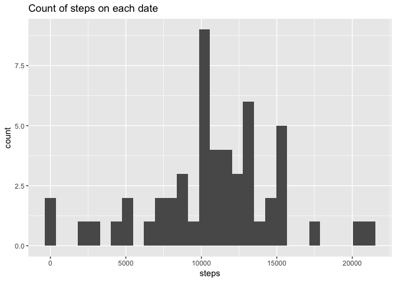
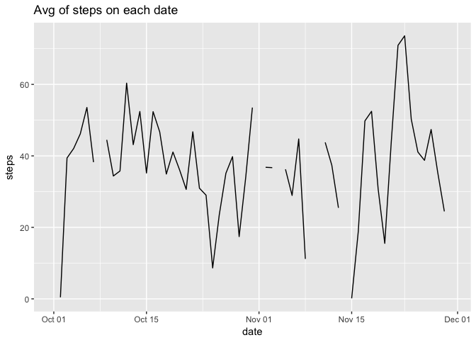
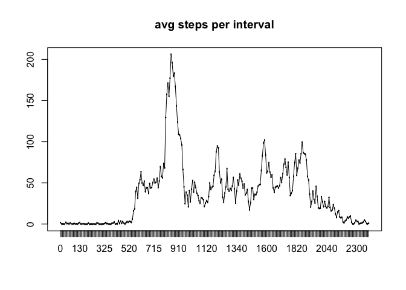
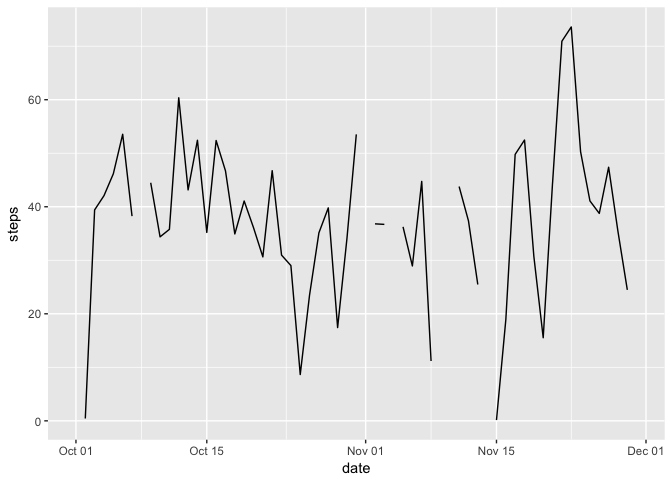
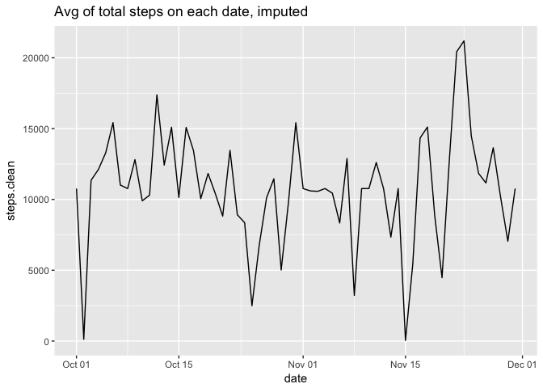
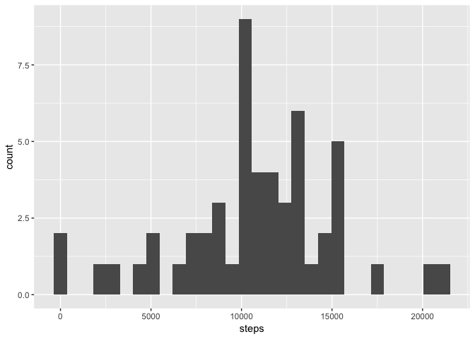
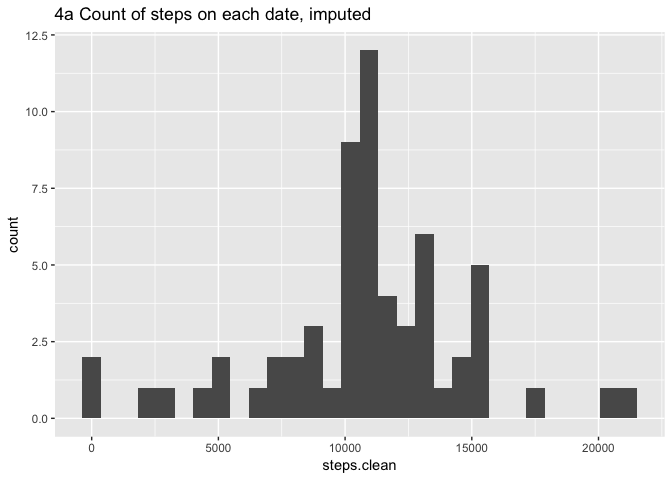
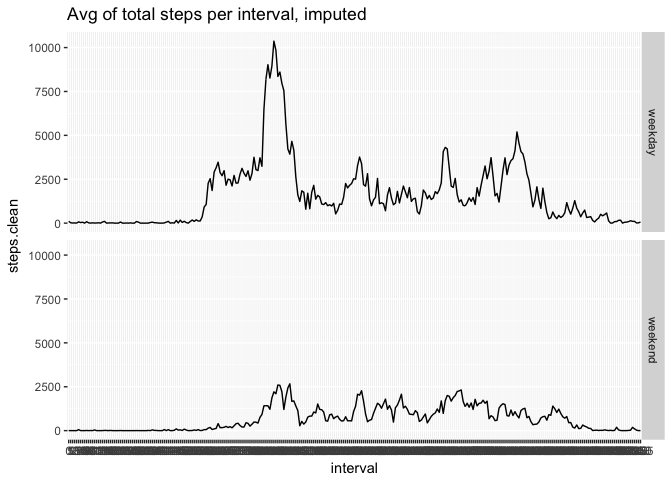

# Reproducible Research: Peer Assessment 1

*Notes on grading: This is organized in the order of the assignment instructions (Rather than the commit list)
So below you'll see all the headings and numbered points with only a few alterations for clarity.*
*Also, I don't want to complain too much, but there's nothing in the forums and no one responding to help requests... Holidays maybe, but I was on my own. Please consider that.*

# Loading and preprocessing the data

## Data specifications

The data is 'quantified self' data collected Oct-Nov 2012 and records the steps taken during 5 minute intervals each day.
Dataset: activity.zip (54kb) containing activity.csv (351kb) with 17,568 observations
Variables are the following:
- steps: Number of steps taken in a 5-minute interval (missing values are coded as NA) 
- date: The date on which the measurement was taken in YYYY-MM-DD format; 61 days
- interval: 4-digit Identifier for the 5-minute interval in which measurement was taken; 288 intervals 0-2355.

## 1. Load the data, 2. Process/transform the data

It's relatively clean already with 3 columns, headers, and comma separation with NA strings=NA. Default read.csv will work well.

We'll need rmarkdown,markdown,knitr packages first. Install manually first if necessary.

We'll also take time to fix the dates.
We need to convert the interval to factors, not just numeric.

You'll see a str of the raw and new data and a summary here and later to see new tables.

Import method: read.csv

```r
options(warn=-1) # to suppress meaningless version warnings.
# packages below are the whole point of the assignment and will error if not installed.
library(markdown)
library(rmarkdown)
library(knitr)
options(warn=0) # turn warnings back on.

# unzip and read in raw data
rawzip <- unz('activity.zip', filename="activity.csv")
rawcsv <- read.csv(rawzip,na.strings='NA',header=TRUE,sep=",")

# prep raw data for use and look at summaries.
str(rawcsv)
```

```
## 'data.frame':	17568 obs. of  3 variables:
##  $ steps   : int  NA NA NA NA NA NA NA NA NA NA ...
##  $ date    : Factor w/ 61 levels "2012-10-01","2012-10-02",..: 1 1 1 1 1 1 1 1 1 1 ...
##  $ interval: int  0 5 10 15 20 25 30 35 40 45 ...
```

```r
newcsv <- rawcsv
newcsv$interval <- factor(rawcsv$interval)
newcsv$date <- as.Date(rawcsv$date,"%Y-%m-%d")
str(newcsv)
```

```
## 'data.frame':	17568 obs. of  3 variables:
##  $ steps   : int  NA NA NA NA NA NA NA NA NA NA ...
##  $ date    : Date, format: "2012-10-01" "2012-10-01" ...
##  $ interval: Factor w/ 288 levels "0","5","10","15",..: 1 2 3 4 5 6 7 8 9 10 ...
```

```r
summary(newcsv)
```

```
##      steps             date               interval    
##  Min.   :  0.00   Min.   :2012-10-01   0      :   61  
##  1st Qu.:  0.00   1st Qu.:2012-10-16   5      :   61  
##  Median :  0.00   Median :2012-10-31   10     :   61  
##  Mean   : 37.38   Mean   :2012-10-31   15     :   61  
##  3rd Qu.: 12.00   3rd Qu.:2012-11-15   20     :   61  
##  Max.   :806.00   Max.   :2012-11-30   25     :   61  
##  NA's   :2304                          (Other):17202
```

# What is mean total number of steps taken per day?

## 1. Steps per day: 2. histogram, 3. mean, and median.

Also, the histogram needs to be steps per day. observations are currently in 5 min intervals.
We'll use aggregate to do get total steps per day and reset the column names.
**Steps per day is found in newcsv.day**
Note that the NAs still have not been removed per instructions.

For this and later plots, we'll use ggplot.
That should be installed first if not already.

With summary, we see the **Median is 10,765 steps per day, and the Mean is 10,766 steps per day**.


```r
# aggregate collapses the observations to provide sums by date, with names added back.
newcsv.day <- aggregate(newcsv$steps,by=list(newcsv$date),FUN=sum)
names(newcsv.day) <- c("date","steps")

summary(newcsv.day)
```

```
##       date                steps      
##  Min.   :2012-10-01   Min.   :   41  
##  1st Qu.:2012-10-16   1st Qu.: 8841  
##  Median :2012-10-31   Median :10765  
##  Mean   :2012-10-31   Mean   :10766  
##  3rd Qu.:2012-11-15   3rd Qu.:13294  
##  Max.   :2012-11-30   Max.   :21194  
##                       NA's   :8
```

```r
# this plot as histogram provides the results of steps per day in buckets of 30 by default.
# ggplot is required and will error if not installed.
library(ggplot2)
```

```
## Warning: package 'ggplot2' was built under R version 3.3.2
```

```r
g.day <- ggplot(data=newcsv.day, aes(steps)) + geom_histogram()
g.day+labs(title="Count of steps on each date")
```

```
## `stat_bin()` using `bins = 30`. Pick better value with `binwidth`.
```

```
## Warning: Removed 8 rows containing non-finite values (stat_bin).
```

<!-- -->

# What is the average daily activity pattern? 

## 1. Time-series plot.

*Assignment: Make a time series plot (i.e. 𝚝𝚢𝚙𝚎 = "𝚕") of the 5-minute interval (x-axis) and the average number of steps taken, averaged across all days (y-axis)*

I'm not 100% sure what this is asking, but more specifically, I am answering this question:
Plot average steps taken per day, y=steps and x=date, still with NAs included.

To do this, we'll do aggregate again, but use the mean instead of sum.
And obviously an xy plot.
Note the blanks for NAs and other missing data.


```r
# see prior code chunk, except we're doing average rather than sum in this chunk.
newcsv.day.avg <- aggregate(newcsv$steps,by=list(newcsv$date),FUN=mean)
names(newcsv.day.avg) <- c("date","steps")

summary(newcsv.day.avg)
```

```
##       date                steps        
##  Min.   :2012-10-01   Min.   : 0.1424  
##  1st Qu.:2012-10-16   1st Qu.:30.6979  
##  Median :2012-10-31   Median :37.3785  
##  Mean   :2012-10-31   Mean   :37.3826  
##  3rd Qu.:2012-11-15   3rd Qu.:46.1597  
##  Max.   :2012-11-30   Max.   :73.5903  
##                       NA's   :8
```

```r
g.day.avg <- ggplot(data=newcsv.day.avg, aes(date,steps))+geom_line()
g.day.avg+labs(title="Avg of steps on each date")
```

```
## Warning: Removed 2 rows containing missing values (geom_path).
```

<!-- -->

## 2. Which 5-minute interval, on average across all the days in the dataset, contains the maximum number of steps?.

The 5-minute interval that, on average, contains the maximum number of steps
To find this, we'll aggregate by interval mean and use a summary to find the largest.
Leaving NAs returns NA for all data points. 

A chart is not strictly required as far as I understand, but I've included one for good measure.
It does confirm the code that 835, **8:35-8:40AM is the has the highest average steps**.


```r
newcsv.int.avg <- aggregate(newcsv$steps,by=list(newcsv$interval),FUN=mean,na.rm=TRUE)
names(newcsv.int.avg) <- c("interval","steps")

summary(newcsv.int.avg)
```

```
##     interval       steps        
##  0      :  1   Min.   :  0.000  
##  5      :  1   1st Qu.:  2.486  
##  10     :  1   Median : 34.113  
##  15     :  1   Mean   : 37.383  
##  20     :  1   3rd Qu.: 52.835  
##  25     :  1   Max.   :206.170  
##  (Other):282
```

```r
newcsv.int.avg[newcsv.int.avg$steps==max(newcsv.int.avg$steps),]
```

```
##     interval    steps
## 104      835 206.1698
```

```r
plot(newcsv.int.avg$interval,newcsv.int.avg$steps,main="avg steps per interval")
lines(newcsv.int.avg$interval,newcsv.int.avg$steps)
```

<!-- -->

# Imputing missing values

## 1. Count missing/NAs 2. Make a strategy and fill in the NAs
We saw earlier with summary that **there are 2304 NAs in the step counts**.

One option is to replace NA with 0.
Many of the NAs are at 1AM, so 0 is probably the real number.
Another option is to replace NA with the mean for that interval, or another statistic.
That would smooth the data but maybe make unjustified assumptions.

We already have the mean for each interval.
The summary above shows no NAs for interval means.
**My strategy will be to use the interval mean.**

## 3. Create a new dataset that is equal to the original dataset but with the missing data filled in.

We know the intervals are no intervals missing: 288-61=17568.
That makes things a bit simpler.
We'll duplicate the steps column with NAs.
Then add the step average for each interval from our interval averages.
Then wherever we have an NA in steps.clean, we'll clean it by adding the average.
And with summary, we see the changes made, no NAs (and mostly 0s).


```r
newcsv.imp <- newcsv # start with original
newcsv.imp$steps.clean <- newcsv$steps # add "clean" column with NAs
newcsv.imp$steps.avg <- newcsv.int.avg$steps # add new column with interval avgs
newcsv.imp$steps.clean[which(is.na(newcsv.imp$steps.clean))] <- newcsv.imp$steps.avg[which(is.na(newcsv.imp$steps.clean))] # replace NAs with avgs in new column.
summary(newcsv.imp) # look at new table with 'clean' column
```

```
##      steps             date               interval      steps.clean    
##  Min.   :  0.00   Min.   :2012-10-01   0      :   61   Min.   :  0.00  
##  1st Qu.:  0.00   1st Qu.:2012-10-16   5      :   61   1st Qu.:  0.00  
##  Median :  0.00   Median :2012-10-31   10     :   61   Median :  0.00  
##  Mean   : 37.38   Mean   :2012-10-31   15     :   61   Mean   : 37.38  
##  3rd Qu.: 12.00   3rd Qu.:2012-11-15   20     :   61   3rd Qu.: 27.00  
##  Max.   :806.00   Max.   :2012-11-30   25     :   61   Max.   :806.00  
##  NA's   :2304                          (Other):17202                   
##    steps.avg      
##  Min.   :  0.000  
##  1st Qu.:  2.486  
##  Median : 34.113  
##  Mean   : 37.383  
##  3rd Qu.: 52.835  
##  Max.   :206.170  
## 
```

## 4 Steps per day with imputed values

*Long question, see below, but first we need a dataset to work with.*

We need a histogram of steps per day just like before but we're using the imputed values.
Those values are in the new steps.clean column of newcsv.imp, rolled up by day.
This means jus adding .imp and .clean everywhere from our earlier code.


```r
# Use aggregate as before with prepared data, date and steps.
newcsv.imp.day <- aggregate(newcsv.imp$steps.clean,by=list(newcsv.imp$date),FUN=sum)
names(newcsv.imp.day) <- c("date","steps.clean")

summary(newcsv.imp.day)
```

```
##       date             steps.clean   
##  Min.   :2012-10-01   Min.   :   41  
##  1st Qu.:2012-10-16   1st Qu.: 9819  
##  Median :2012-10-31   Median :10766  
##  Mean   :2012-10-31   Mean   :10766  
##  3rd Qu.:2012-11-15   3rd Qu.:12811  
##  Max.   :2012-11-30   Max.   :21194
```

```r
# print original and imputed avg, then original and imputed total for comparison.
g.day.avg
```

```
## Warning: Removed 2 rows containing missing values (geom_path).
```

<!-- -->

```r
g.imp.day <- ggplot(data=newcsv.imp.day, aes(date,steps.clean))+geom_line()
g.imp.day+labs(title="Avg of total steps on each date, imputed")
```

<!-- -->

```r
g.day
```

```
## `stat_bin()` using `bins = 30`. Pick better value with `binwidth`.
```

```
## Warning: Removed 8 rows containing non-finite values (stat_bin).
```

<!-- -->

```r
g.imp.day.h <- ggplot(data=newcsv.imp.day, aes(steps.clean)) + geom_histogram()
g.imp.day.h+labs(title="4a Count of steps on each date, imputed")
```

```
## `stat_bin()` using `bins = 30`. Pick better value with `binwidth`.
```

<!-- -->

## Answer all the questions

*Long question: Make a (4a) histogram of the total number of steps taken each day and Calculate and report the (4b) mean and (4c) median total number of steps taken per day. Do these values (4d) differ from the estimates from the first part of the assignment? What is the (4e) impact of imputing missing data on the estimates of the total daily number of steps?*

**Answers**:
The histogram (4a g.imp.day.h) looks good - (4d) basically like before but with blanks filled in.
This also means the counts are a bit higher and shifted a bit to the right.
And with the summary, we have (4b) median and (4c) mean of 10766.
This is not (4e) surprising as they were close before, and we added more mean values.
The biggest change is the Max, and that would be most likely to increase as we filled in values.

# Are there differences in activity patterns between weekdays and weekends?

## 1. Add weekends/weekdays factor variable

We're asked for 5 minute intervals on the x-axis and average of steps taken in that interval on the y-axis. Then 2 panels, one weekend and one weekday. We're asked to use the imputed data.

For this we'll create newcsv.imp.int from newcsv.int.
Then add a column weekx to indicate factor weekday or weekend.
I did verify (not shown) 12960 and 4608 are the expected counts for weekday and weekend.


```r
# add weekdays by names, then convert to weekday or weekend, then convert to factor
newcsv.imp$weekx <- weekdays(newcsv.imp$date,abbreviate=TRUE)
newcsv.imp$weekx <- ifelse(newcsv.imp$weekx=="Sat" | newcsv.imp$weekx=="Sun",c("weekend"),c("weekday"))
newcsv.imp$weekx <- as.factor(newcsv.imp$weekx)

summary(newcsv.imp)
```

```
##      steps             date               interval      steps.clean    
##  Min.   :  0.00   Min.   :2012-10-01   0      :   61   Min.   :  0.00  
##  1st Qu.:  0.00   1st Qu.:2012-10-16   5      :   61   1st Qu.:  0.00  
##  Median :  0.00   Median :2012-10-31   10     :   61   Median :  0.00  
##  Mean   : 37.38   Mean   :2012-10-31   15     :   61   Mean   : 37.38  
##  3rd Qu.: 12.00   3rd Qu.:2012-11-15   20     :   61   3rd Qu.: 27.00  
##  Max.   :806.00   Max.   :2012-11-30   25     :   61   Max.   :806.00  
##  NA's   :2304                          (Other):17202                   
##    steps.avg           weekx      
##  Min.   :  0.000   weekday:12960  
##  1st Qu.:  2.486   weekend: 4608  
##  Median : 34.113                  
##  Mean   : 37.383                  
##  3rd Qu.: 52.835                  
##  Max.   :206.170                  
## 
```

```r
# Then aggregate to new listing of steps by interval rollowed up by weekx(day/end) rather than date.
newcsv.imp.int <- aggregate(newcsv.imp$steps.clean,by=list(newcsv.imp$interval,newcsv.imp$weekx),FUN=sum)
names(newcsv.imp.int) <- c("interval","weekx","steps.clean")

summary(newcsv.imp.int)
```

```
##     interval       weekx      steps.clean      
##  0      :  2   weekday:288   Min.   :    0.00  
##  5      :  2   weekend:288   1st Qu.:   58.39  
##  10     :  2                 Median :  778.08  
##  15     :  2                 Mean   : 1140.17  
##  20     :  2                 3rd Qu.: 1587.18  
##  25     :  2                 Max.   :10367.02  
##  (Other):564
```

## Make a panel plot containing a time series plot...

Now we can plot. We are free to use any plot system, so we'll use ggplot again.
The assignment example had a (-4,4) range with negatives that wouldn't make sense for steps.
Our range 0-10k, all positive, makes more sense for steps per day.
The lower range for the weekend is interesting.


```r
# basic ggplot faceted by weekx counting steps on various intervals.
g.imp.int <- ggplot(data=newcsv.imp.int, aes(x=interval,y=steps.clean, group=weekx))+geom_line()
g.imp.int <- g.imp.int+labs(title="Avg of total steps per interval, imputed")
g.imp.int <- g.imp.int+facet_grid(weekx~.)
g.imp.int
```

<!-- -->

